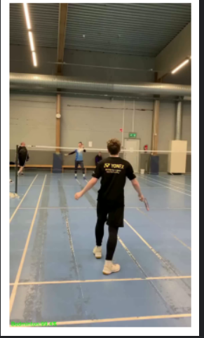
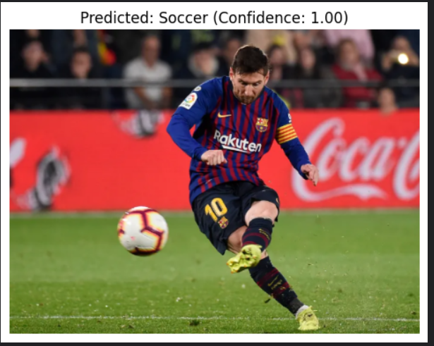

# Sports Identification System Using Computer Vision

A complete end-to-end solution for classifying sports in images and videos using deep learning. Leveraging transfer learning on EfficientNet-B0, this project supports image-level prediction, video annotation, and real-time inference.

## Table of Contents

- [Project Overview](#project-overview)  
- [Dataset](#dataset)  
- [Environment Setup](#environment-setup)  
- [Usage](#usage)  
  - [1. Jupyter Notebook](#1-jupyter-notebook)  
  - [2. Image Prediction](#2-image-prediction)  
  - [3. Video Annotation](#3-video-annotation)  
  - [4. Model Training](#4-model-training)  
- [Model Architecture](#model-architecture)  
- [Evaluation Metrics](#evaluation-metrics)  
- [Project Structure](#project-structure)  
- [Contributing](#contributing)  
- [License](#license)  

---

## Project Overview

Identify which sport is depicted in an image or video frame. The pipeline includes:

- **Image classification** with EfficientNet-B0 transfer learning  
- **Frame-level video annotation** with overlaid predictions  
- **Real-time inference** with confidence scores  
- **Comprehensive training pipeline** with data augmentation and validation

---

## Dataset

**Sports Image Classification** (Kaggle dataset by Siddheshwar Harkal)  

- **Classes (7):** Badminton, Cricket, Karate, Soccer, Swimming, Tennis, Wrestling  
- **Train images:** 8,227 labeled  
- **Test images:** 2,056 unlabeled  
- **Structure:**
  ```
  dataset/
  ├── train/
  │   └── [image_ID].jpg
  ├── test/
  │   └── [image_ID].jpg
  ├── train.csv    # image_ID,label
  └── test.csv     # image_ID
  ```  

Add this under `data/` or attach via Kaggle Notebook's **Add data** option.

---

## Environment Setup

1. **Clone repository**  
   ```
   git clone https://github.com/YourUsername/YourRepo.git
   cd YourRepo
   ```

2. **Create virtual environment**  
   ```
   python3 -m venv venv
   source venv/bin/activate  # On Windows: venv\Scripts\activate
   ```

3. **Install dependencies**  
   ```
   pip install -r requirements.txt
   ```
   **`requirements.txt`** includes:
   ```
   torch>=1.8.0
   torchvision>=0.9.0
   timm
   pandas
   numpy
   opencv-python
   pillow
   matplotlib
   scikit-learn
   ffmpeg-python
   ```

4. **(Optional) Install FFmpeg**  
   - **Windows:** Download from [FFmpeg official site](https://ffmpeg.org/download.html)
   - **macOS:** `brew install ffmpeg`
   - **Ubuntu:** `sudo apt-get update && sudo apt-get install -y ffmpeg`

---

## Usage

### 1. Jupyter Notebook

Open `sportsclassification.ipynb` in your preferred environment:

- **Local Jupyter:** Run `jupyter notebook` and open the file
- **Kaggle:** Upload the notebook and add the dataset
- **Google Colab:** Upload the notebook to Colab

The notebook includes:
- Data loading and preprocessing
- Model training with EfficientNet-B0
- Validation and evaluation
- Image prediction
- Video annotation

### 2. Image Prediction

```python
from PIL import Image
import torch
import timm
from torchvision import transforms as T

# Load model
model = timm.create_model('efficientnet_b0', pretrained=False, num_classes=7)
model.load_state_dict(torch.load('best_sports_model.pth', map_location='cpu'))
model.eval()

# Load and preprocess image
transform = T.Compose([
    T.Resize((224, 224)),
    T.ToTensor(),
    T.Normalize(mean=[0.485, 0.456, 0.406], std=[0.229, 0.224, 0.225])
])

image = Image.open('path/to/image.jpg').convert('RGB')
tensor = transform(image).unsqueeze(0)

# Predict
with torch.no_grad():
    logits = model(tensor)
    probs = torch.softmax(logits[0], dim=0)
    confidence, idx = torch.max(probs, dim=0)

class_names = ['Badminton', 'Cricket', 'Karate', 'Soccer', 'Swimming', 'Tennis', 'Wrestling']
predicted_label = class_names[idx]
print(f"Predicted: {predicted_label} (Confidence: {confidence:.2f})")
```

### 3. Video Annotation

The notebook includes a complete video annotation pipeline:

1. **Convert video to H.264 (if needed):**
   ```bash
   ffmpeg -i input_video.mp4 -c:v libx264 converted.mp4
   ```

2. **Run annotation script:**
   ```python
   # The notebook includes this functionality
   # It processes each frame and overlays predictions
   # Outputs annotated video and CSV with frame-level predictions
   ```

3. **Output files:**
   - `output.mp4` - Annotated video with sport labels and confidence
   - `predictions.csv` - Frame-by-frame predictions

### 4. Model Training

The notebook provides a complete training pipeline:

- **Data augmentation:** Random horizontal flip, rotation, color jittering
- **Model:** EfficientNet-B0 with custom classifier head
- **Training:** 15 epochs with validation split (80/20)
- **Optimization:** Adam optimizer with learning rate scheduling
- **Best model:** Automatically saved based on validation accuracy

---

## Model Architecture

- **Backbone:** EfficientNet-B0 pretrained on ImageNet  
- **Head:** Custom classifier for 7 sports classes  
- **Input size:** 224x224 RGB images
- **Loss:** CrossEntropyLoss  
- **Optimizer:** Adam (lr=1e-3) with StepLR scheduler  
- **Data augmentation:** Horizontal flip, rotation, color jittering

---

## Evaluation Metrics

Training results (15 epochs):
| Epoch | Train Loss | Train Acc | Val Loss | Val Acc |
|-------|------------|-----------|----------|---------|
| 1     | 0.6122     | 0.8310    | 0.2678   | 0.9113  |
| 5     | 0.1232     | 0.9620    | 0.1914   | 0.9490  |
| 10    | 0.0088     | 0.9980    | 0.1660   | 0.9617  |
| 15    | 0.0023     | 0.9994    | 0.1543   | **0.9690** |

**Final Validation Accuracy: 96.90%**

The model shows excellent convergence with minimal overfitting, achieving high accuracy on both training and validation sets.

---

## Prediction Examples

### Badminton Classification

*Indoor badminton court scene with players in action - Model correctly identifies the sport with high confidence*

### Soccer/Football Classification  

*Lionel Messi in action - Model achieves perfect confidence (1.00) in soccer classification*

These examples demonstrate the model's ability to accurately identify sports across different scenarios, from indoor court sports to outdoor field sports, with high confidence levels.

---

## Project Structure

```
sport classification/
├── sportsclassification.ipynb    # Main notebook with complete pipeline
├── best_sports_model.pth        # Trained model weights (16MB)
└── README.md                    # This file
```

**Key Components:**
- **SportsDataset class:** Custom PyTorch dataset for sports images
- **Training pipeline:** Complete training loop with validation
- **Inference functions:** Image and video prediction utilities
- **Video processing:** Frame-by-frame annotation with OpenCV

---

## Features

### ✅ Implemented
- [x] EfficientNet-B0 transfer learning
- [x] Custom dataset class with data augmentation
- [x] Training pipeline with validation
- [x] Image prediction with confidence scores
- [x] Video annotation with frame-level predictions
- [x] Model checkpointing and best model saving

### 🔄 Future Enhancements
- [ ] Real-time webcam inference
- [ ] Object detection for equipment and players
- [ ] Multi-sport classification in single images
- [ ] API endpoint for predictions
- [ ] Mobile deployment optimization

---

## Contributing

1. Fork this repository  
2. Create a branch: `git checkout -b feature-name`  
3. Commit: `git commit -m "Add new feature"`  
4. Push: `git push origin feature-name`  
5. Open a pull request  

---

## License

This project is licensed under the **MIT License**.

---

## Acknowledgments

- **Dataset:** Sports Image Classification by Siddheshwar Harkal on Kaggle
- **Model Architecture:** EfficientNet-B0 from timm library
- **Computer Vision:** OpenCV and PyTorch ecosystem
- **Training Framework:** PyTorch with modern best practices
